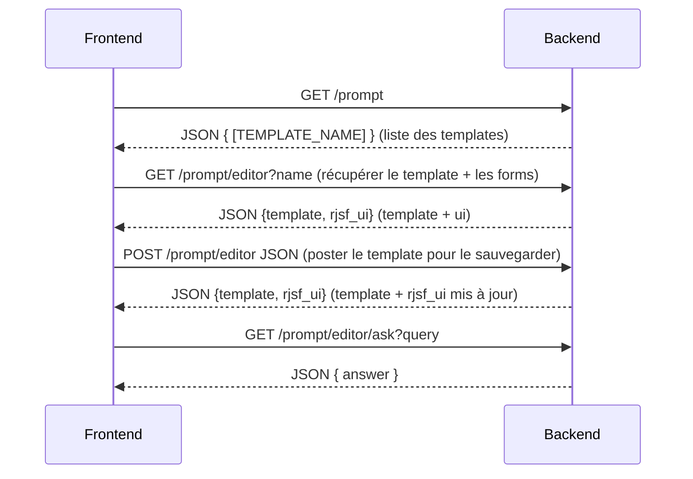

```mermaid
    sequenceDiagram
        participant Frontend
        participant Backend
        Frontend->>Backend: GET /prompt
        Backend-->>Frontend: JSON { [TEMPLATE_NAME] } (liste des templates)
        Frontend->>Backend: GET /prompt/editor?name (récupérer le template + les forms)
        Backend-->>Frontend: JSON {template, rjsf_ui}  (template + ui)
        Frontend->>Backend: POST /prompt/editor JSON (poster le template pour le sauvegarder)
        Backend-->>Frontend: JSON {template, rjsf_ui} (template + rjsf_ui mis à jour)
        Frontend->>Backend: GET /prompt/editor/ask?query
        Backend-->>Frontend: JSON { answer }
```
